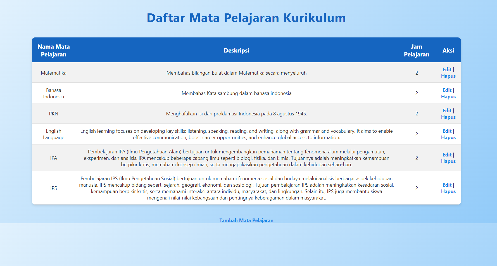
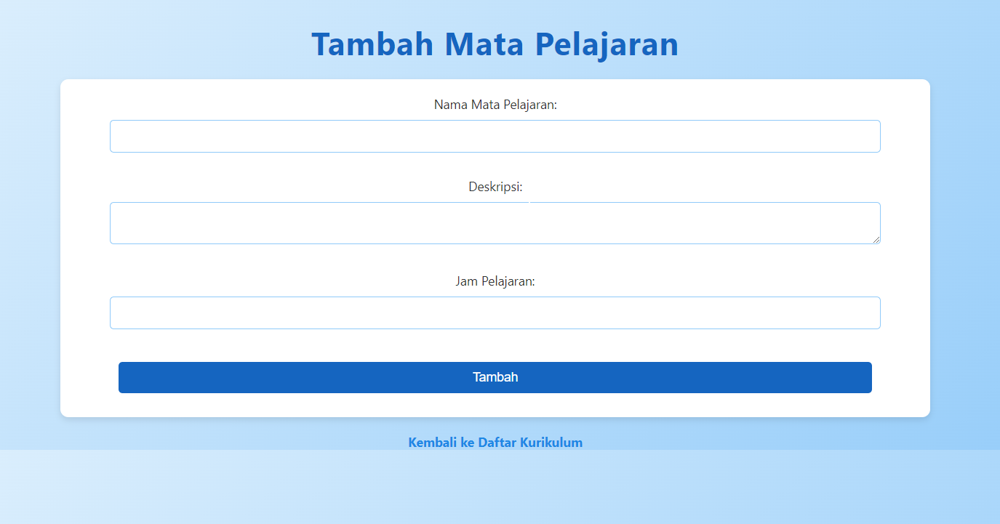

# Kurikulum

Ini adalah aplikasi web sederhana untuk mengelola kurikulum pembelajaran. Aplikasi ini memungkinkan pengguna untuk melihat, menambahkan, dan mengelola materi pelajaran.

## Struktur Proyek

- **`http://localhost/app/Minggu-1/Jum'at/Kurikulum/`**: Halaman utama yang menampilkan daftar materi pelajaran yang ada dalam kurikulum.
- **`http://localhost/app/Minggu-1/Jum'at/Kurikulum/add.php`**: Halaman untuk menambahkan materi pelajaran baru ke dalam kurikulum.

## Fitur

- **Daftar Materi Pelajaran**: Menampilkan semua materi pelajaran yang telah ditambahkan ke dalam kurikulum.
- **Tambah Materi Baru**: Mengizinkan pengguna untuk menambahkan materi pelajaran baru dengan mengisi form yang disediakan.

## Teknologi yang Digunakan

- **PHP**: Bahasa pemrograman yang digunakan untuk mengembangkan backend.
- **HTML/CSS**: Digunakan untuk membuat tampilan antarmuka pengguna.
- **SQLite**: Database yang digunakan untuk menyimpan data materi pelajaran.

## Hasil Web dalam Bentuk Gambar
 
 